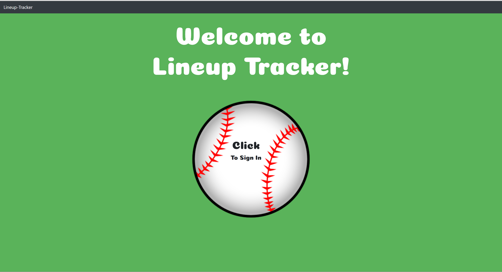
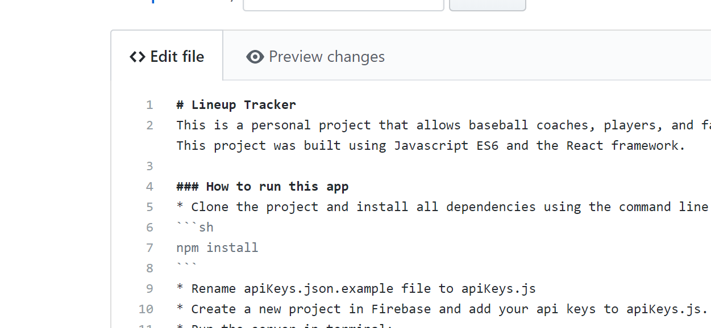

# Lineup Tracker
This is a personal project that allows baseball coaches, players, and fans to store and keep track of lineups from past and future games. This project was built using Javascript ES6 and the React framework. 

### How to run this app
* Clone the project and install all dependencies using the command line:
```sh
npm install
```
* Rename apiKeys.json.example file to apiKeys.js
* Create a new project in Firebase and add your api keys to apiKeys.js. 
* Run the server in terminal:
```sh
npm start
```

## Screenshots





